# wing-cfd-analysis

✈️ Aerodynamic Design and CFD Analysis of a Fixed-Wing with Canted Winglets

📌 Overview

This project presents a complete aerodynamic design and CFD analysis of a fixed-wing UAV, including preliminary sizing, simulation, and validation using ANSYS Fluent and OpenVSP.

🔍 Key Contributions

1-UAV aerodynamic design using Raymer methodology.

2-CFD comparison between clean wing and winglet.

3-Validation using two independent tools.

📐 Preliminary Design (MATLAB)

A constraint analysis was performed using MATLAB based on Raymer’s methodology to determine the optimal design point. The relationship between wing loading (W/S) and power loading (W/P) was evaluated under multiple performance constraints, including stall speed, maximum speed, takeoff distance, rate of climb, and service ceiling.
The feasible design region was identified, and an optimal configuration was selected. Based on this, the wing geometry was defined, and the S5010 airfoil was selected from the NASA database.

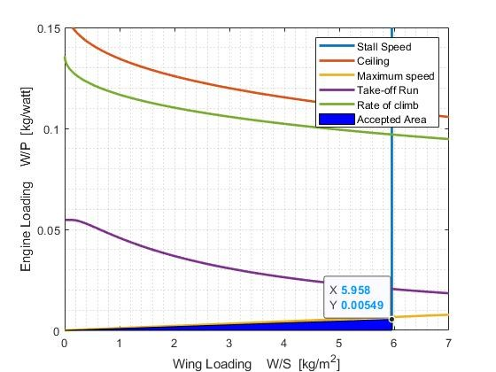

🛠️ Geometry & CFD Analysis (ANSYS)

-Geometry modeling and meshing were performed using ANSYS ICEM

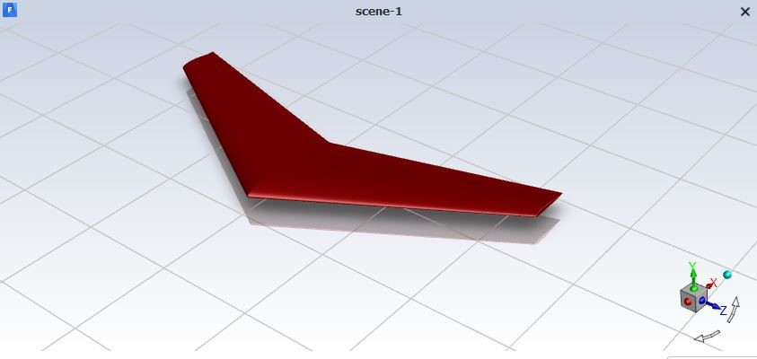

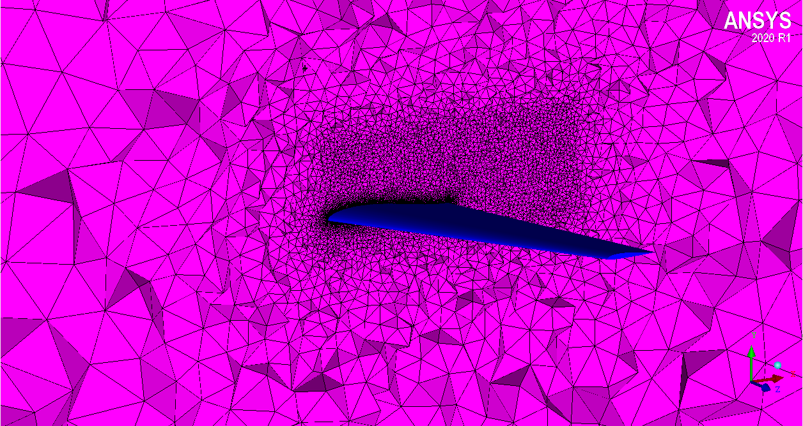

-CFD simulations were conducted in ANSYS Fluent

👉Limitations:

1-Steady-state simulations.

2-Assumptions in turbulence modeling.

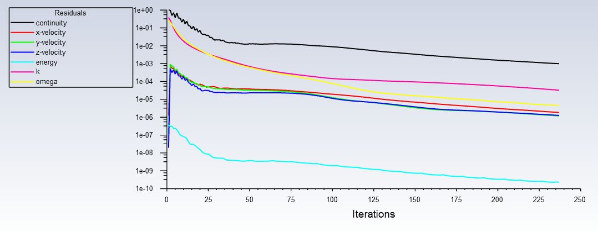

-Two configurations were analyzed:

  1-Clean wing
  
  2-Wing with canted winglet

🔬 Comparative Study

A comparative analysis was performed to evaluate the impact of winglets on aerodynamic performance. The results show that the addition of canted winglets improves aerodynamic efficiency by reducing drag and enhancing lift characteristics.

📊 Aerodynamic Performance Curves

The variation of aerodynamic coefficients with angle of attack was analyzed for clean wing and wing with winglet using Excel:

-Lift coefficient (Cl) vs Angle of Attack

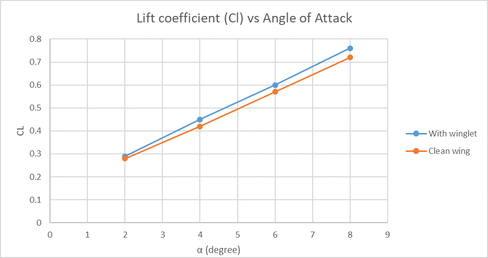

-Drag coefficient (Cd) vs Angle of Attack

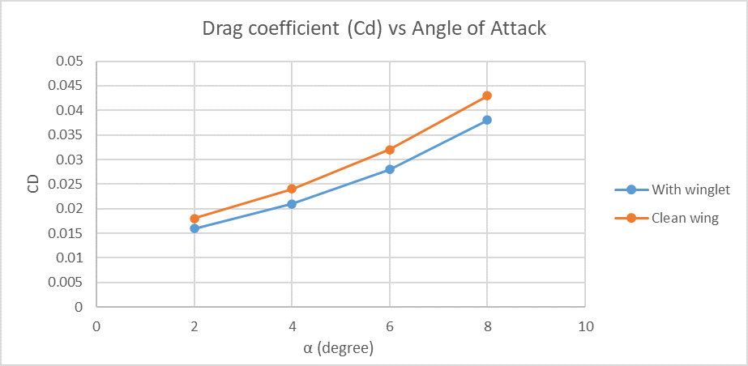

-Aerodynamic efficiency (Cl/Cd) vs Angle of Attack

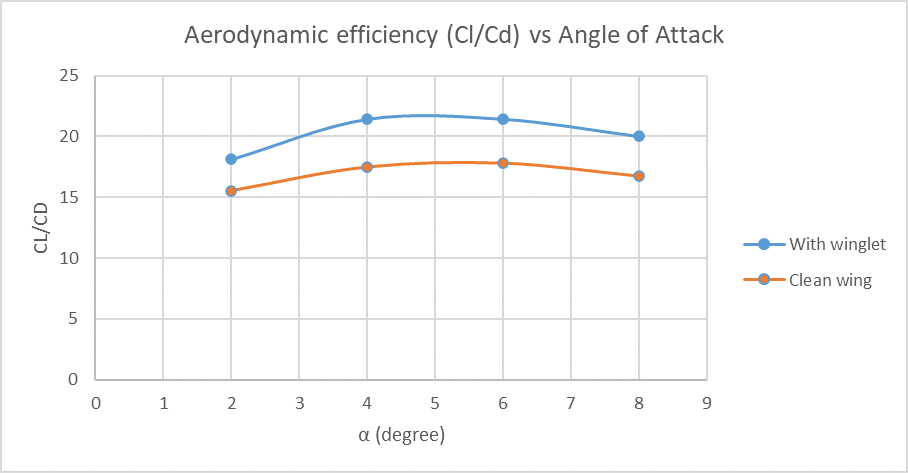

These results highlight the performance trends of both configurations and demonstrate the aerodynamic benefits of winglets across multiple operating conditions.

🔁 Cross-Validation (OpenVSP)

The same configurations were modeled and analyzed using OpenVSP. A comparison between ANSYS Fluent and OpenVSP results showed consistent aerodynamic trends, confirming the reliability of the simulations and the validity of the design approach.

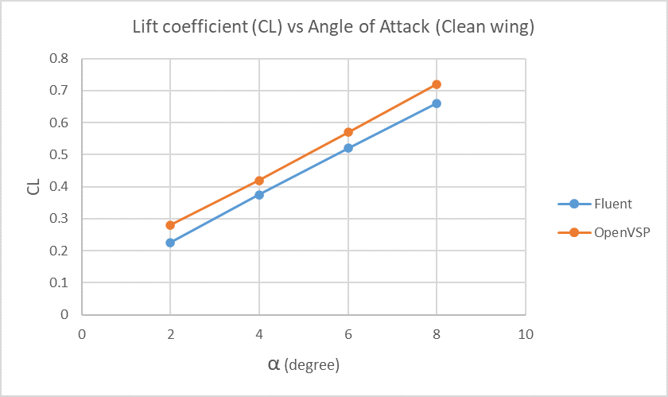

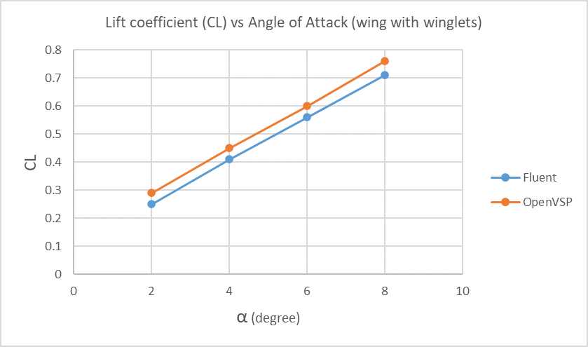

🌪️ Wingtip Vortex Visualization
Velocity vector plots were used to analyze the airflow behavior around the wingtip for both configurations.

-Clean Wing

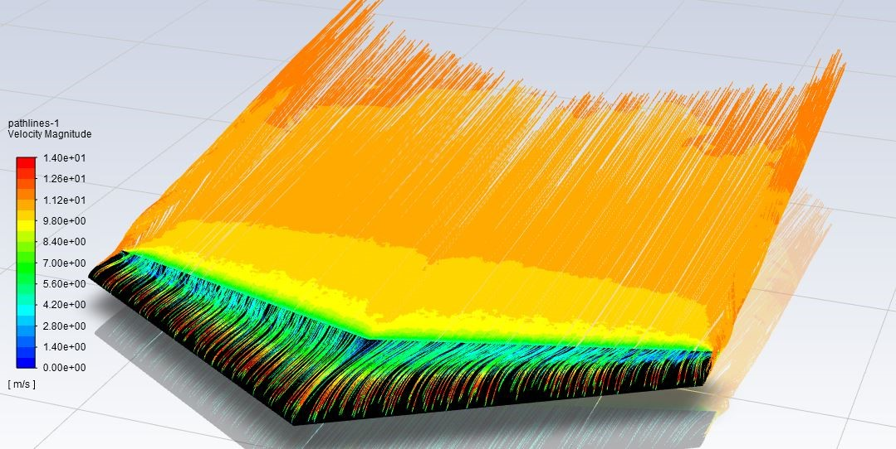

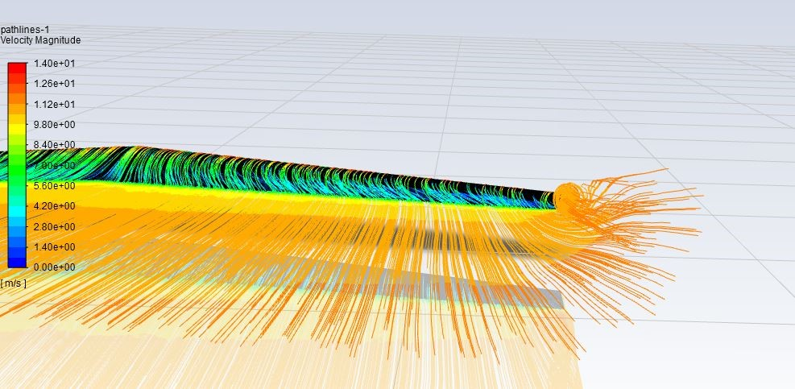

-Wing with Canted Winglet

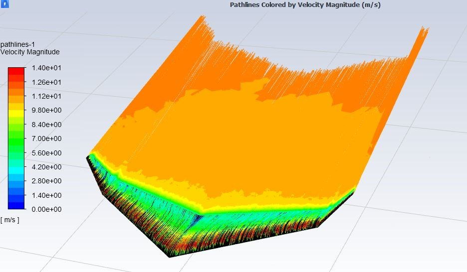

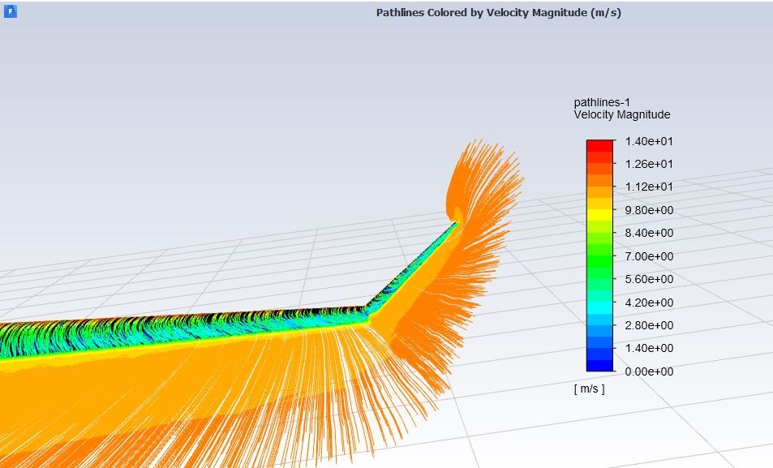

The results show that the addition of winglets reduces the strength of wingtip vortices and shifts them away from the wing surface. This leads to a more stable airflow and contributes to improved aerodynamic efficiency.

👉Discussion:

The improvements observed are consistent with aerodynamic theory, where winglets reduce induced drag by weakening wingtip vortices.

🧠 Conclusion

A parametric analysis was conducted for angles of attack ranging from 2° to 8°. The results show consistent aerodynamic improvements with the integration of canted winglets across all tested conditions. At an angle of attack of 6°, the winglet configuration achieved a drag reduction of approximately 3% and a lift increase of about 8%, resulting in an overall efficiency improvement of around 11%.
The trends observed in lift, drag, and aerodynamic efficiency confirm the effectiveness of winglets in enhancing performance. Additionally, the agreement between ANSYS Fluent and OpenVSP results validates the reliability of the simulation approach.

📄 Full Report

A detailed version of this project is available in Arabic and has been officially archived at the Higher Institute for Applied Science and Technology (HIAST), Aleppo, Syria. The report includes full design methodology, CFD analysis, and results.

👉 An English summary will be provided soon.

👉All modeling, simulations, and analysis were performed independently.

👉 Developed as part of my undergraduate studies in Aeronautical Engineering.
